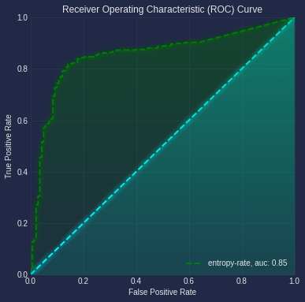
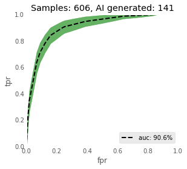

## NERO: Non-parametric Entropy Rate Oracle



## Description

Recognizing AI generated content by estimating the entropy rate of the symbol stream over the 26+1 letter alphabet (English).
We hypothesize that human generated content has a higher entropy rate. Shannon's experimental approach suggested that English has
an entropy rate of 1 bit / letter (`Shannon, Claude E. "Prediction and entropy of printed English." Bell system technical journal 30, no. 1 (1951): 50-64.`), and we found that  that AI generated content, with current LLM models, typically has much less. Thus, this approach of estimating the non-parametric entropy rate of a symbol stream gnerated by mapping text to teh described 27 letter alphabet is simulatenously a reliable detector of AI-generated test, as well as suggests the metrioc that future modifiactions of LLMs shoukld attempt to bet, particulalry to generate human-like longform material. In particular this requires no training. Since the idea is that we use the proposed algorithm to estimate the entropy rate of a given source, and that computed quantity is small for AI-generated material; no training is necessary.


However, the performance goes up even more, when we do employ some training as illustrated in teh next figure.



The basic algorithm was reported in a conference paper by Chattopadhyay and Lipson, at a time when its application in identifying AI-generated text  was
not a topic of interest, since the current sophisticated LLMs did not yet exist.


```
I. Chattopadhyay and H. Lipson, "Computing entropy rate of symbol sources & a distribution-free limit theorem," 2014 48th Annual Conference on Information Sciences and Systems (CISS), Princeton, NJ, USA, 2014, pp. 1-6, doi: 10.1109/CISS.2014.6814175.
```

## Overview of the entropr rate estimation algorithm

Entropy rate of sequential data-streams naturally quantifies the complexity of the generative process. Thus entropy rate fluctuations could be used as a tool to recognize dynamical perturbations in signal sources, and could potentially be carried out without explicit background noise characterization. However, state of the art algorithms to estimate the entropy rate have markedly slow convergence; making such entropic approaches non-viable in practice. We present here a fundamentally new approach to estimate entropy rates, which is demonstrated to converge significantly faster in terms of input data lengths, and is shown to be effective in diverse applications ranging from the estimation of the entropy rate of English texts to the estimation of complexity of chaotic dynamical systems. Additionally, the convergence rate of entropy estimates do not follow from any standard limit theorem, and reported algorithms fail to provide any confidence bounds on the computed values. Exploiting a connection to the theory of probabilistic automata, we establish a convergence rate of O(log|s|/3√|s|) as a function of the input length |s|, which then yields explicit uncertainty estimates, as well as required data lengths to satisfy pre-specified confidence bounds.